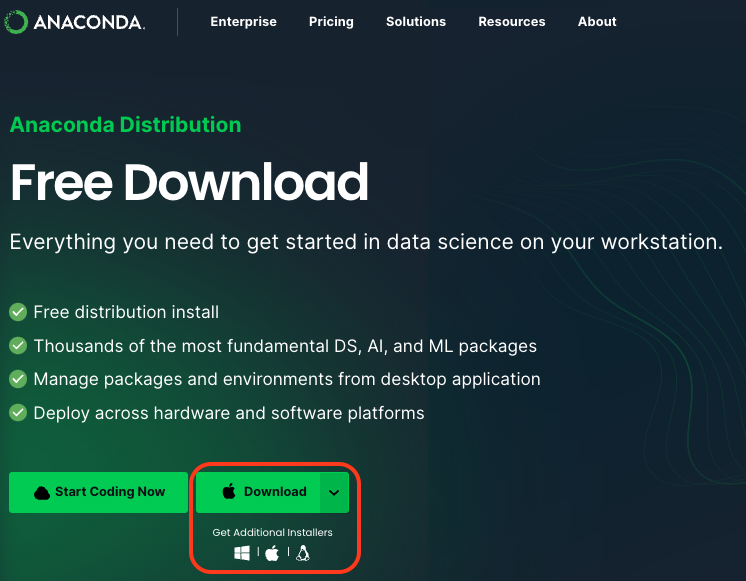
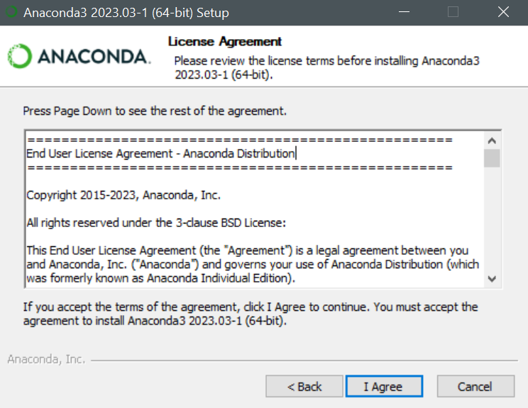
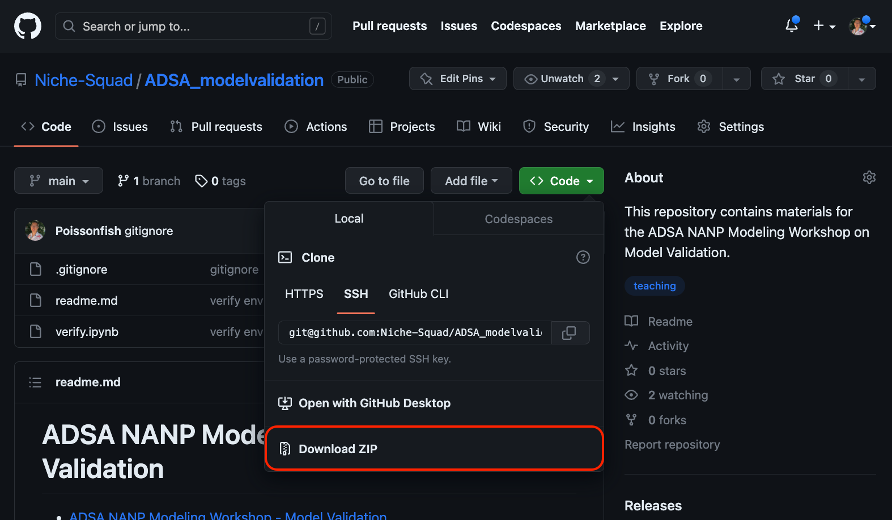
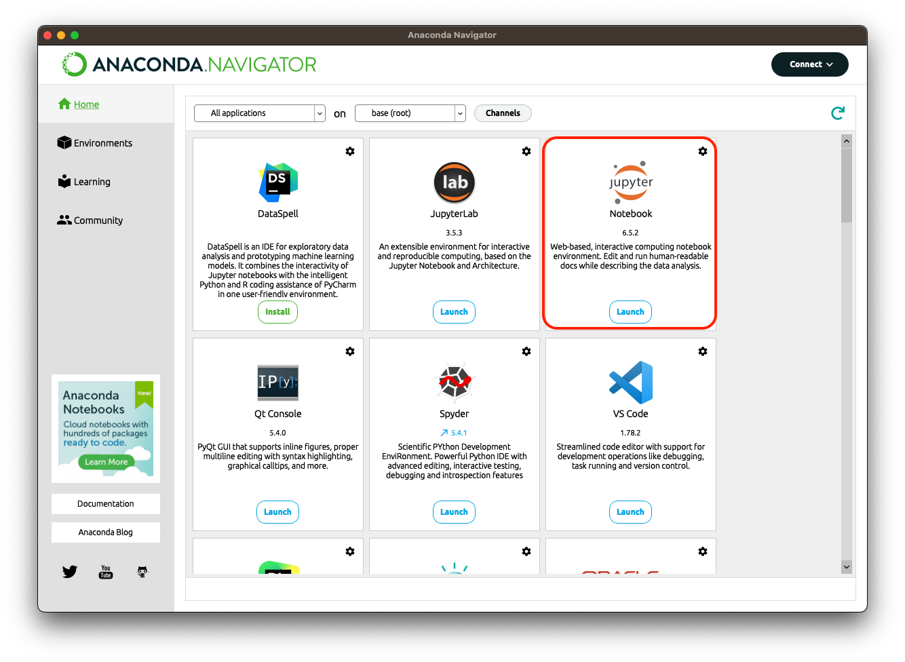
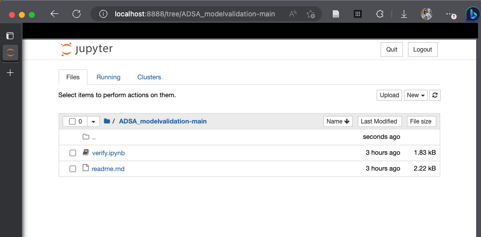
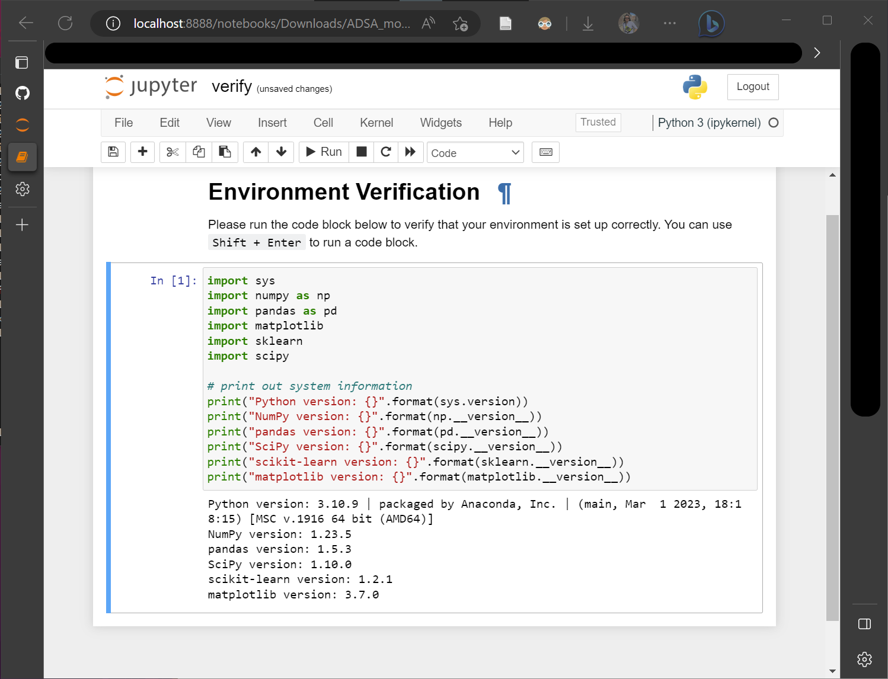
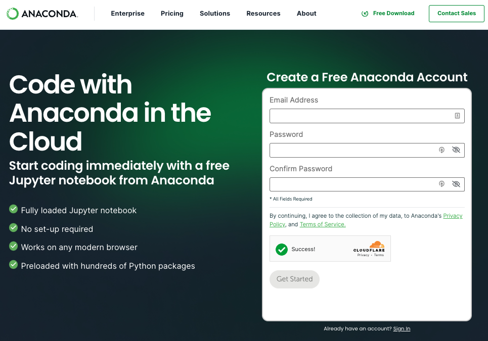
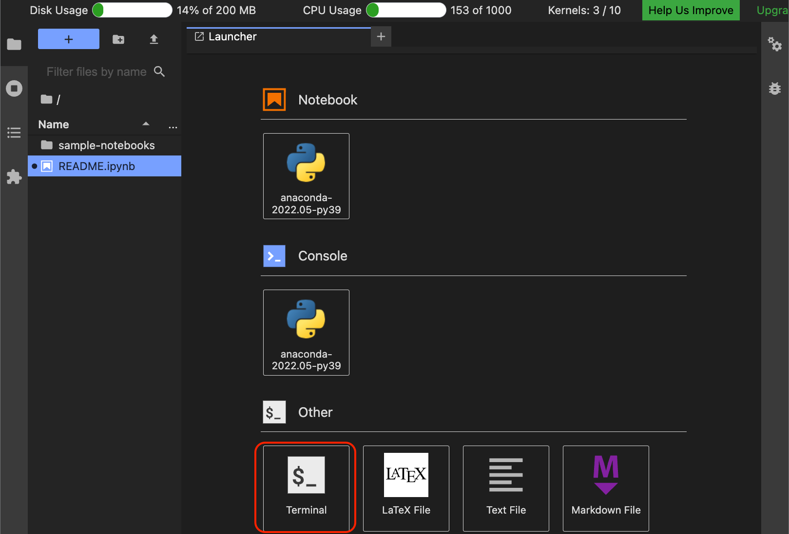
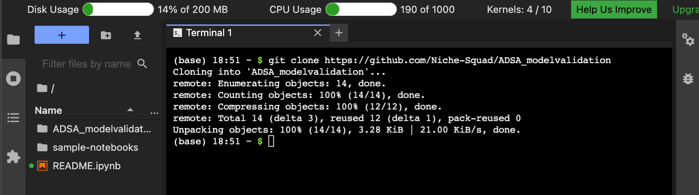
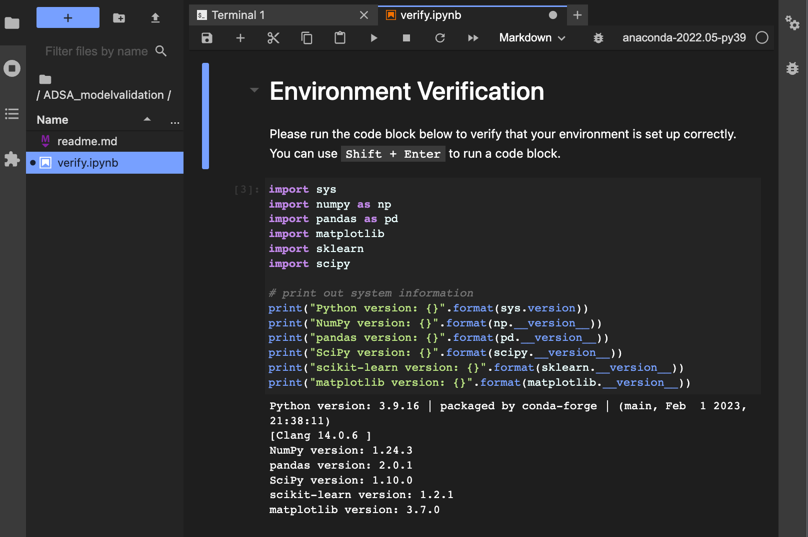

# ADSA NANP Modeling Workshop - Model Validation

Author: [James Chen](<https://www.apsc.vt.edu/OurPeople/Faculty/james-chen.html>)

- [ADSA NANP Modeling Workshop - Model Validation](#adsa-nanp-modeling-workshop---model-validation)
  - [0. Overview](#0-overview)
  - [1. Environment Setup](#1-environment-setup)
    - [1.1 Option 1 (recommended): Run on your local machine](#11-option-1-recommended-run-on-your-local-machine)
      - [1.1.1: Install Anaconda Distribution](#111-install-anaconda-distribution)
      - [1.1.2: Download the workshop repository](#112-download-the-workshop-repository)
      - [1.1.3: Verify your environment](#113-verify-your-environment)
    - [1.2 Option 2: Run on Anaconda Cloud](#12-option-2-run-on-anaconda-cloud)
      - [1.2.1: Register an Anaconda Cloud account](#121-register-an-anaconda-cloud-account)
      - [1.2.2: Clone the workshop repository](#122-clone-the-workshop-repository)
      - [1.2.3: Verify the online environment](#123-verify-the-online-environment)
  - [2. Getting Started](#2-getting-started)
    - [2.1 `note01_train_test_split.ipynb`](#21-note01_train_test_splitipynb)
    - [2.2 `note02_hyperparameter.ipynb`](#22-note02_hyperparameteripynb)
    - [2.3 `note03_factor_validation.ipynb`](#23-note03_factor_validationipynb)

**⚠️IMPORTANT⚠️
This repository is under development. Please check back one week (*June 18th, 2023*) before the workshop for the final version of the workshop materials**

## 0. Overview

This repository contains materials for the ADSA NANP Modeling Workshop on model validation. This workshop is designed to offer a hands-on introduction to the prevalent risks involved in evaluating predictive models. We will run through several simulations to demonstrate the importance of model validation, aiming to answer the following questions:

- Why is it necessary to split our data into training and testing sets for the purpose of model validation?
- How do we validate a model (e.g., a random forest) that includes hyperparameters?
- How does the method of splitting data based on different experimental factors influence our conclusions during model validation?

## 1. Environment Setup

Please make sure to set up your environment before the workshop. You can choose to run the workshop materials on your local machine or on Anaconda Cloud.

[back to top](#adsa-nanp-modeling-workshop---model-validation)

### 1.1 Option 1 (recommended): Run on your local machine

To ensure the best quality of this workshop and to avoid any internet connectivity issues, we recommend that you run the workshop materials on your local machine. To do so, you will need to install `Python` and `Jupyter Notebook`, which is an interactive coding environment, on your machine.

#### 1.1.1: Install Anaconda Distribution



`Anaconda` is the easiest way to get started with `Python` and `Jupyter Notebook`. Go to <https://www.anaconda.com/download> to download the `Anaconda` distribution and install it on your machine. You DO NOT need to change any settings during the installation.



#### 1.1.2: Download the workshop repository

GO to <https://github.com/Niche-Squad/ADSA_modelvalidation> and click the green button `Code` -> `Download ZIP` to download the workshop repository. Unzip the downloaded file and save it to a location on your machine.



#### 1.1.3: Verify your environment

Open the `Anaconda Navigator` and launch `Jupyter Notebook`.



In the `Jupyter Notebook`, navigate to the workshop repository folder that you just unzipped.



Open the file `verify.ipynb`. Follow the instruction in the notebook to run the verification code block. If you can run the code block without any errors, you are all set for the workshop!



[back to top](#adsa-nanp-modeling-workshop---model-validation)

### 1.2 Option 2: Run on Anaconda Cloud

If you encounter any issues with the local environment setup, you can choose to run the workshop materials online. The advantage of this option is that you do not need to install any software on your machine. However, you will need to have a stable internet connection during the workshop.

#### 1.2.1: Register an Anaconda Cloud account

Anaconda offers a free cloud service that allows you to run `Jupyter Notebook` on the cloud. It requires you to register an account for the service. Go to <https://www.anaconda.com/code-in-the-cloud> and follow the instructions to register an account.



#### 1.2.2: Clone the workshop repository

Once you log in to your Anaconda Cloud account, you will see a dashboard. Go to `Other` section and open `Terminal`.



In `Terminal`, run the following command to clone the workshop repository to your cloud account:

```bash
git clone https://github.com/Niche-Squad/ADSA_modelvalidation
```



#### 1.2.3: Verify the online environment

On the left panel of the dashboard, click `ADSA_modelvalidation` and open the file `verify.ipynb`. Follow the instruction in the notebook to run the verification code block. If you can run the code block without any errors, you are all set for the workshop!



[back to top](#adsa-nanp-modeling-workshop---model-validation)

## 2. Getting Started

Now you are ready to start the workshop! We will cover three important topics in model validation. Please use the jupyter notebooks in this repository to follow along with the following topics:

### 2.1 `note01_train_test_split.ipynb`

Why is it necessary to split our data into training and testing sets for the purpose of model validation?

### 2.2 `note02_hyperparameter.ipynb`

How do we validate a model (e.g., a random forest) that includes hyperparameters?

### 2.3 `note03_factor_validation.ipynb`

How does the method of splitting data based on different experimental factors influence our conclusions during model validation?

[back to top](#adsa-nanp-modeling-workshop---model-validation)
